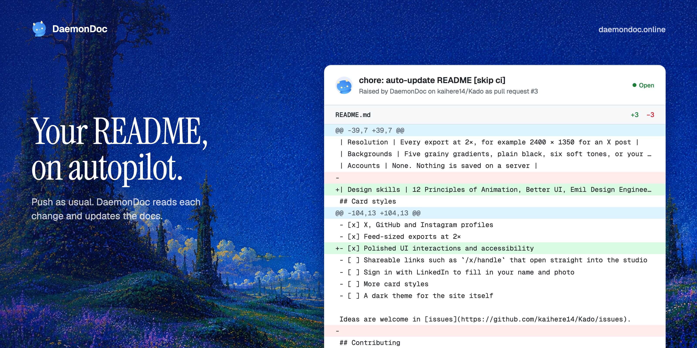
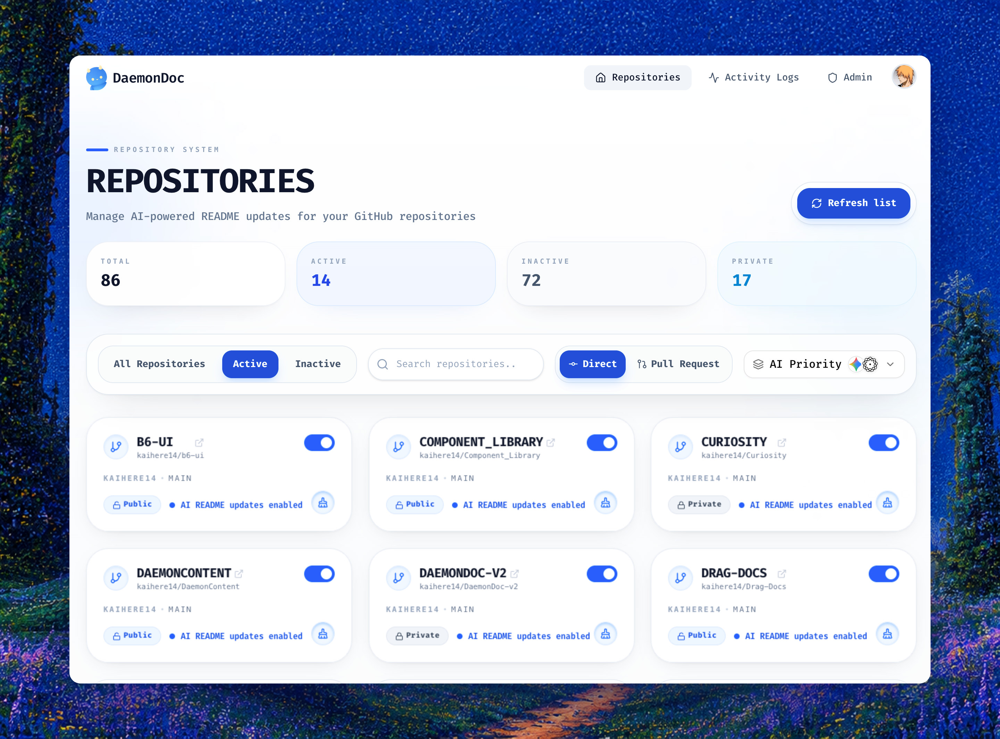
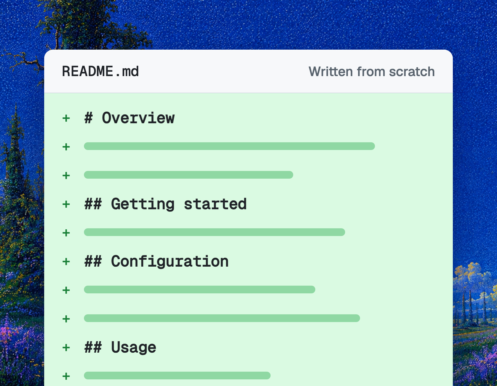
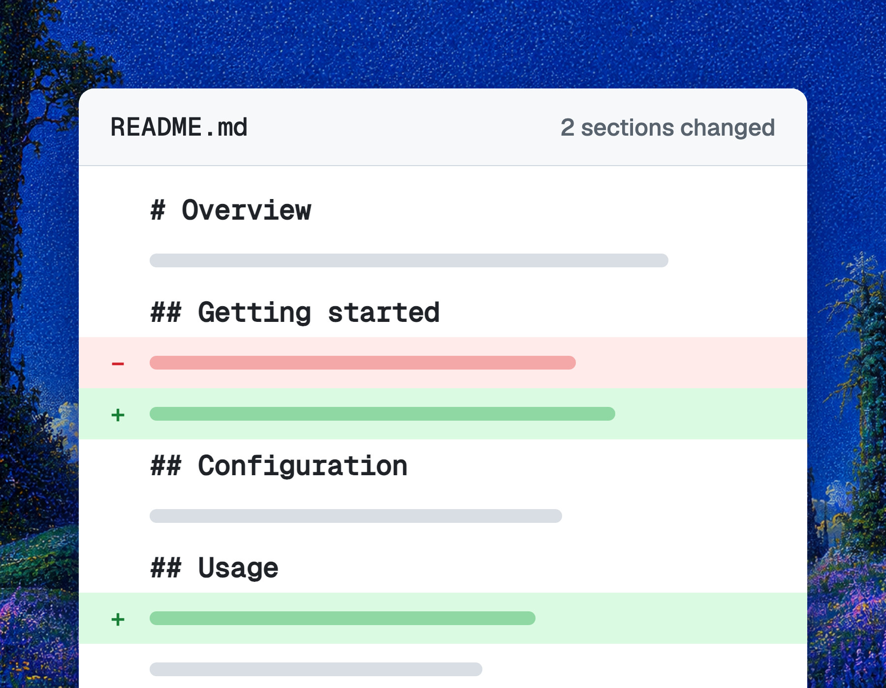
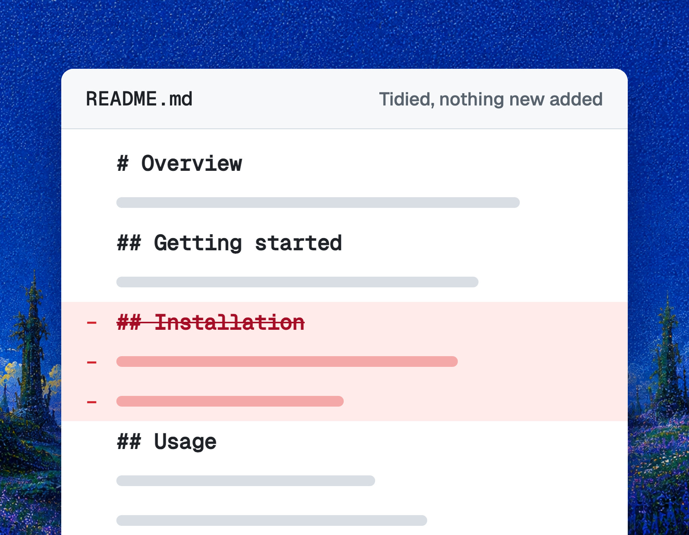
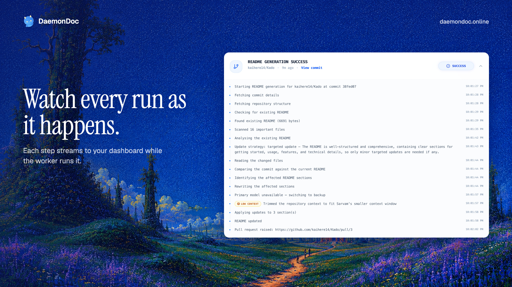

<p align="center">
  
</p>

<p align="center">
  Connect a GitHub repo once, and every push to main comes back as an up-to-date README.<br>
  No templates to fill in, no docs drifting behind the code.
</p>

<h4 align="center">
  <a href="https://daemondoc.online">Website</a> |
  <a href="#getting-started">Getting started</a> |
  <a href="#how-it-works">How it works</a> |
  <a href="#self-hosting">Self-hosting</a> |
  <a href="#roadmap">Roadmap</a>
</h4>

<p align="center">
  
  
  
  
  
  
  <a href="LICENSE"></a>
  
</p>

DaemonDoc keeps your README in step with your code. It listens for pushes to your default branch, reads what changed, and decides whether the README needs a full rewrite or only a few sections touched. Then it writes the update with Gemini (or Sarvam AI when Gemini is busy) and commits it back to the repo, or opens a pull request if you'd rather review it first. You watch each run step by step from the dashboard.

<p align="center">
  
</p>

## Highlights

|               |                                                                                                              |
| ------------- | ------------------------------------------------------------------------------------------------------------ |
| Trigger       | A GitHub push webhook on the default branch, verified with HMAC-SHA256                                       |
| Update modes  | Full rewrite, section patch, and on-demand cleanup                                                           |
| Delivery      | A direct commit, or a pull request from a `daemondoc/readme-*` branch                                        |
| Models        | Gemini first, rotating across up to three API keys, with Sarvam AI as the fallback. Each user sets the order |
| Context       | Up to 200 files read on a full rewrite, about 180K tokens sent to the model                                  |
| Live logs     | Every step of every run streams to the dashboard as it happens                                               |
| Loop guard    | DaemonDoc's own commits carry `[skip ci]`, so they never start another run                                   |
| Notifications | An email when a run succeeds or fails, which you can switch off                                              |

## Update modes

<table>
  <tr>
    <td width="33%"></td>
    <td width="33%"></td>
    <td width="33%"></td>
  </tr>
  <tr>
    <td align="center" valign="top"><b>Full rewrite</b><br><sub>Reads the whole repo and writes it fresh</sub></td>
    <td align="center" valign="top"><b>Section patch</b><br><sub>Rewrites only the sections a push touched</sub></td>
    <td align="center" valign="top"><b>Cleanup</b><br><sub>Tidies a messy README, adds nothing new</sub></td>
  </tr>
</table>

A small, fast model reads the current README and picks between a full rewrite and a patch. When the two are close, it chooses the patch, so the parts you wrote yourself stay put. Cleanup runs only when you press the broom button on a repo card.

## Getting started

The hosted version runs at [daemondoc.online](https://daemondoc.online). Nothing to install.

1. Open the [dashboard](https://app.daemondoc.online/login) and choose **Continue with GitHub**.
2. Switch on a repository. DaemonDoc adds a push webhook to it and writes the first README update straight away.
3. Push to the default branch as usual. Each push starts a new run.

## Usage

From the **Repositories** page:

- **The toggle** on each card turns automatic updates on or off for that repo.
- **Direct** or **Pull Request** sets how updates arrive: committed straight to the default branch, or raised as a pull request for you to merge.
- **AI Priority** chooses which model runs first, Gemini or Sarvam AI.
- **The broom button** cleans up the repo's README on demand.

**Activity Logs** lists every run with its status. Open one to see each step, the strategy it chose and why, and a link to the commit or pull request.

## How it works

<p align="center">
  
</p>

1. **Push.** You push to the default branch. Pushes to other branches, DaemonDoc's own commits and commits it has already handled are ignored.
2. **Queue.** The Express server checks the webhook signature, answers GitHub at once, and puts a job on a BullMQ queue in Redis.
3. **Read.** The worker fetches the commit, the repository tree and the current README.
4. **Decide.** With no README, it writes one from scratch. Otherwise the detection model picks a full rewrite or a section patch.
5. **Write.** A full rewrite reads up to 200 files. A patch reads only the changed files and rewrites only the README sections they affect. If Gemini is rate-limited or down, its next key takes over, and after that the run falls back to Sarvam AI with the context trimmed to fit Sarvam's 32K window.
6. **Deliver.** The README is committed as `chore: auto-update README [skip ci]`, or opened as a pull request with the same title.

Every step is pushed to Convex as it happens, so the dashboard updates without polling.

| Part           | Folder           | What it does                                                 |
| -------------- | ---------------- | ------------------------------------------------------------ |
| Dashboard      | `client/`        | React 19 and Vite app at app.daemondoc.online                |
| Website        | `seo-client/`    | Next.js 16 landing site at daemondoc.online                  |
| API and worker | `server/`        | Express 5 API, webhook handler, BullMQ worker, LLM providers |
| Live logs      | `convex-server/` | Convex functions that stream run messages to the dashboard   |

MongoDB stores users, connected repos and run history. Redis backs the job and email queues.

## Security and privacy

- DaemonDoc signs in through GitHub OAuth with the `repo`, `read:user` and `user:email` scopes. It never sees your GitHub password.
- It changes one file, `README.md`, plus the push webhook it adds when you switch a repo on.
- GitHub tokens are stored encrypted with AES-256-GCM.
- To write the README, file contents from your repository are sent to the model provider, Google Gemini or Sarvam AI.
- You can revoke access at any time from [GitHub's application settings](https://github.com/settings/applications), and generation stops at once.

## Self-hosting

DaemonDoc needs Node.js 20 or newer, [pnpm](https://pnpm.io) 10, MongoDB and Redis. You also need a GitHub OAuth app, a [Convex](https://convex.dev) deployment and a Gemini API key.

```sh
git clone https://github.com/kaihere14/DaemonDoc && cd DaemonDoc
pnpm install

# MongoDB and Redis in Docker
docker compose -f docker-compose.devlopment-setup.yml up -d mongo redis
```

Create the environment files below, then start each part:

```sh
pnpm dev:convex   # Convex functions
pnpm dev          # dashboard on :5173 and API on :3000
pnpm dev:seo      # marketing site, optional
```

GitHub must be able to reach `/api/github/webhookhandler` to deliver pushes, so expose the API with a tunnel when running locally.

<details>
<summary><b>Server</b> &nbsp;<code>server/.env</code></summary>

```env
PORT=3000
NODE_ENV=development
MONGO_URI=mongodb://localhost:27017/daemondoc
REDIS_HOST=localhost
REDIS_PORT=6379
REDIS_PASSWORD=
REDIS_USERNAME=default

JWT_SECRET=your_jwt_secret
GITHUB_CLIENT_ID=your_github_client_id
GITHUB_CLIENT_SECRET=your_github_client_secret
GITHUB_CALLBACK_URL=http://localhost:3000/auth/github/callback
GITHUB_WEBHOOK_SECRET=your_github_webhook_secret
GITHUB_TOKEN_SECRET=32_byte_hex_string_for_token_encryption

FRONTEND_URL=http://localhost:5173
BACKEND_URL=http://localhost:3000
CONVEX_URL=https://your-convex-deployment.convex.cloud

GEMINI_API_KEY1=your_primary_gemini_key
GEMINI_API_KEY2=your_secondary_gemini_key
GEMINI_API_KEY3=your_tertiary_gemini_key
SARVAM_API_KEY=your_sarvam_api_key

RESEND_API_KEY=your_resend_api_key
README_FILE_NAME=README.md
```

One Gemini key is enough. Blank key slots are skipped.

</details>

<details>
<summary><b>Dashboard</b> &nbsp;<code>client/.env</code></summary>

```env
VITE_BACKEND_URL=http://localhost:3000
VITE_CONVEX_URL=https://your-convex-deployment.convex.cloud
VITE_PUBLIC_POSTHOG_PROJECT_TOKEN=your_posthog_token
VITE_PUBLIC_POSTHOG_HOST=https://us.i.posthog.com
VITE_MARKETING_URL=http://localhost:3001
```

</details>

<details>
<summary><b>Website</b> &nbsp;<code>seo-client/.env</code></summary>

```env
NEXT_PUBLIC_APP_URL=http://localhost:5173
```

</details>

To run the API in Docker instead:

```sh
docker build -t daemondoc-server ./server
docker run -p 3000:3000 --env-file server/.env daemondoc-server
```

<details>
<summary><b>API reference</b></summary>

#### Authentication `/auth`

| Method   | Endpoint                      | Description                                    |
| :------- | :---------------------------- | :--------------------------------------------- |
| `GET`    | `/auth/github`                | Redirects to GitHub OAuth                      |
| `GET`    | `/auth/github/callback`       | Handles the OAuth callback                     |
| `POST`   | `/auth/verify`                | Validates the JWT and returns the user         |
| `GET`    | `/auth/providers`             | Lists the available LLM providers              |
| `PATCH`  | `/auth/llm-provider-priority` | Sets the user's provider order                 |
| `PATCH`  | `/auth/email-notifications`   | Turns run emails on or off                     |
| `PATCH`  | `/auth/commit-type`           | Chooses direct commits or pull requests        |
| `DELETE` | `/auth/delete`                | Deletes the account, its webhooks and its logs |

#### Repositories `/api/github`

| Method | Endpoint                             | Description                              |
| :----- | :----------------------------------- | :--------------------------------------- |
| `GET`  | `/api/github/getGithubRepos`         | Lists the user's GitHub repositories     |
| `POST` | `/api/github/addRepoActivity`        | Turns a repo on and creates its webhook  |
| `POST` | `/api/github/deactivateRepoActivity` | Turns a repo off and removes its webhook |
| `POST` | `/api/github/webhookhandler`         | Receives GitHub push events              |
| `GET`  | `/api/github/fetchUserLogs`          | Returns the user's recent runs           |
| `POST` | `/api/github/cleanUpReadme`          | Queues a README cleanup                  |
| `GET`  | `/api/github/admin/analytics`        | Run analytics (admin)                    |
| `GET`  | `/api/github/admin/users`            | Paginated user list (admin)              |

#### Email broadcast `/api/email` (admin)

| Method | Endpoint                  | Description                   |
| :----- | :------------------------ | :---------------------------- |
| `GET`  | `/api/email/recipients`   | Lists broadcast recipients    |
| `POST` | `/api/email/send`         | Queues a feature update email |
| `GET`  | `/api/email/queue-status` | Shows email queue metrics     |

</details>

## Roadmap

- [x] Full rewrites and section patches on every push
- [x] Gemini with Sarvam AI fallback and per-user model order
- [x] Live run logs on the dashboard
- [x] Pull request delivery
- [x] One-click README cleanup
- [ ] Install as a GitHub App instead of per-repo webhooks
- [ ] Pull request reviews with line comments
- [ ] Code search across the whole repo for richer context

Ideas are welcome in [issues](https://github.com/kaihere14/DaemonDoc/issues).

## Contributing

Contributions are welcome. Fork the repository, create a branch, and open a pull request. Commit messages follow [Conventional Commits](https://www.conventionalcommits.org), and a pre-commit hook formats staged files. Before submitting, run:

```sh
pnpm lint
pnpm typecheck
pnpm test
```

## Built with

- [React 19](https://react.dev), [Vite](https://vite.dev) and [Next.js 16](https://nextjs.org)
- [Express 5](https://expressjs.com) with [BullMQ](https://bullmq.io) on [Redis](https://redis.io)
- [MongoDB](https://www.mongodb.com) and [Mongoose](https://mongoosejs.com)
- [Convex](https://convex.dev) for live logs
- The [AI SDK](https://ai-sdk.dev) with [Google Gemini](https://ai.google.dev), and [Sarvam AI](https://www.sarvam.ai)
- [Resend](https://resend.com) for email
- [Tailwind CSS 4](https://tailwindcss.com) and [Lucide](https://lucide.dev) icons

## About the name

A daemon is a program that runs in the background without anyone starting it by hand, like the processes that keep a server alive. DaemonDoc is one for your documentation: it waits for a push, does its work, and gets out of the way. The mascot is a friendly blue imp, a nod to the older meaning of the word.

## Star history

<a href="https://star-history.com/#kaihere14/DaemonDoc&Date">
  <picture>
    <source media="(prefers-color-scheme: dark)" srcset="https://api.star-history.com/svg?repos=kaihere14/DaemonDoc&type=Date&theme=dark" />
    <source media="(prefers-color-scheme: light)" srcset="https://api.star-history.com/svg?repos=kaihere14/DaemonDoc&type=Date" />
    
  </picture>
</a>

## License

DaemonDoc is licensed under the [GNU Affero General Public License v3.0](LICENSE).

<p align="center">
  <sub>Made by <a href="https://x.com/ArmanKiyotaka">@ArmanKiyotaka</a></sub>
</p>
