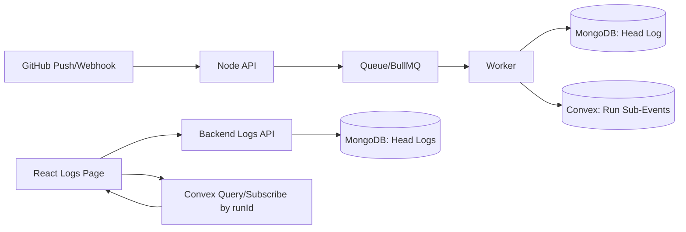
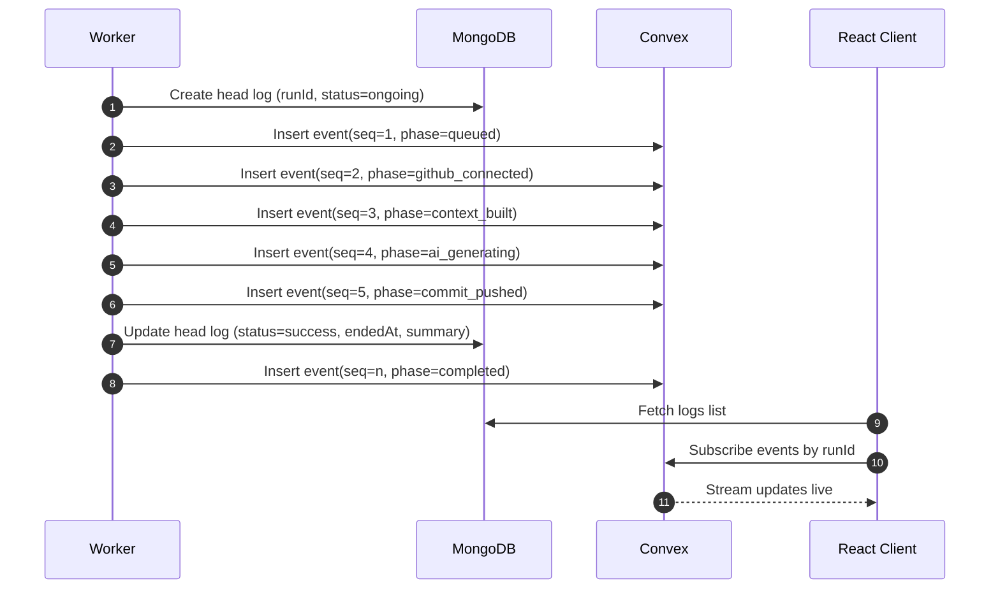
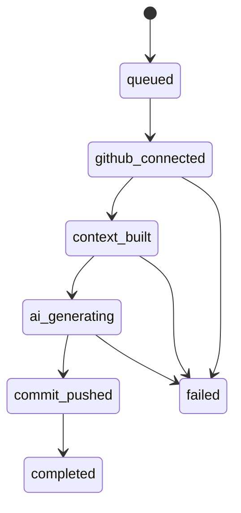

# Convex Live Sub-Events Architecture

## Goal

Use MongoDB and Convex together for logs:

- MongoDB stores the primary run log ("head log") as durable history.
- Convex stores fine-grained live sub-events for each run.
- React reads head logs from backend APIs and subscribes to run sub-events from Convex in real time.

This gives a fast live UX without replacing the existing backend persistence model.

## Why This Split Works

- MongoDB is already integrated in the backend and is suitable for long-term durable records, analytics, and status summaries.
- Convex is optimized for reactive reads/subscriptions, which is ideal for expandable live timelines.
- Backend worker is the only source that knows the true execution path, so it should emit all sub-events.
- Frontend gets low-latency updates directly from Convex while keeping durable state in Mongo.

## Responsibilities

### Backend (Node + Worker)

- Create a `runId` when a job starts.
- Create and update the Mongo head log for the run.
- Emit Convex sub-events during each important processing stage.
- Finalize Mongo head log (`success`, `failed`, `skipped`) when run ends.
- Emit terminal sub-event (`completed` or `failed`).

### Frontend (React)

- Fetch run list/head logs from backend API (Mongo source).
- On expand, subscribe to Convex sub-events by `runId`.
- Render timeline updates in real time while run is active.
- Continue showing final event history after completion.

### Convex

- Store append-only event timeline rows for each `runId`.
- Serve low-latency reactive queries/subscriptions.
- Enforce read authorization so users only see their own run events.

## End-to-End Flow

## Sequence: One README Generation Run

## Data Contract

## Mongo Head Log (durable summary)

Recommended fields:

- `runId` (string, unique per run)
- `userId`
- `repoOwner`
- `repoName`
- `commitId`
- `status` (`ongoing | success | failed | skipped`)
- `startedAt`
- `endedAt`
- `summary` (optional concise message)
- `error` (optional sanitized error payload)

## Convex Sub-Event (live timeline)

Recommended fields:

- `runId`
- `userId`
- `seq` (strict increasing integer per run)
- `ts` (event timestamp)
- `phase` (short machine-friendly stage key)
- `level` (`info | warn | error`)
- `message` (human-readable event line)
- `meta` (small structured metadata, sanitized)

Suggested index/query pattern:

- Primary query: events where `runId = ?`, ordered by `seq`.

## Event Lifecycle

## Security Model

- Worker (trusted backend) writes events to Convex.
- React client reads events directly from Convex.
- Convex auth rules must ensure:
  - user can query only events they own (`event.userId == auth.userId`), or
  - ownership is validated through run ownership mapping.
- Never include secrets in `meta`:
  - access tokens
  - raw credentials
  - full private file contents unless explicitly intended

## Reliability and Idempotency

- Use `(runId, seq)` uniqueness to prevent duplicate event rows.
- Keep event writes best-effort:
  - Convex failure should not fail the whole README job.
- Keep Mongo final status authoritative for run completion.
- On retries:
  - either continue incrementing `seq`, or
  - emit a retry marker event and maintain monotonic ordering.

## Retention Strategy

- Mongo head logs: keep long-term for analytics and audit.
- Convex sub-events: retain short-to-medium term (for example, 7-30 days) based on cost and product needs.
- Optional archival:
  - compact old sub-events into a single summary and purge raw details.

## Implementation Checklist

- Add `runId` creation at job start in worker.
- Persist Mongo head log with `status=ongoing`.
- Add event emitter helper for Convex writes.
- Emit events for all key checkpoints in the worker.
- Update Mongo head log at terminal state.
- In React logs page:
  - list from backend API
  - expand -> subscribe to Convex by `runId`
- Add auth rules and test cross-user isolation.
- Add retention cleanup policy for Convex sub-events.

## Minimal Event Names (Starter Set)

- `queued`
- `github_connected`
- `commit_fetched`
- `repo_tree_fetched`
- `readme_state_detected`
- `mode_selected`
- `context_built`
- `ai_generation_started`
- `ai_generation_completed`
- `commit_pushed`
- `completed`
- `failed`

## Notes for This Codebase

Given the current worker flow, natural event points are around:

- job creation and initial `README_GENERATION_STARTED`
- repository/connectivity validation
- commit and tree fetch
- mode decision (`full` vs `patch`)
- context optimization
- AI generation start/end
- commit success/failure
- final status update (`README_GENERATION_SUCCESS` / `README_GENERATION_FAILED` / `README_GENERATION_SKIPPED`)

This mapping keeps the existing Mongo status model intact while enabling deep, expandable live logs in the UI.
